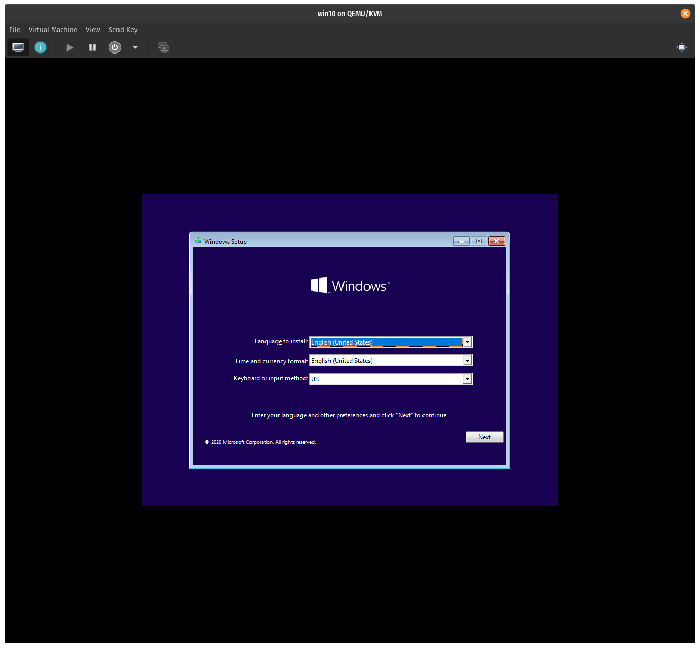
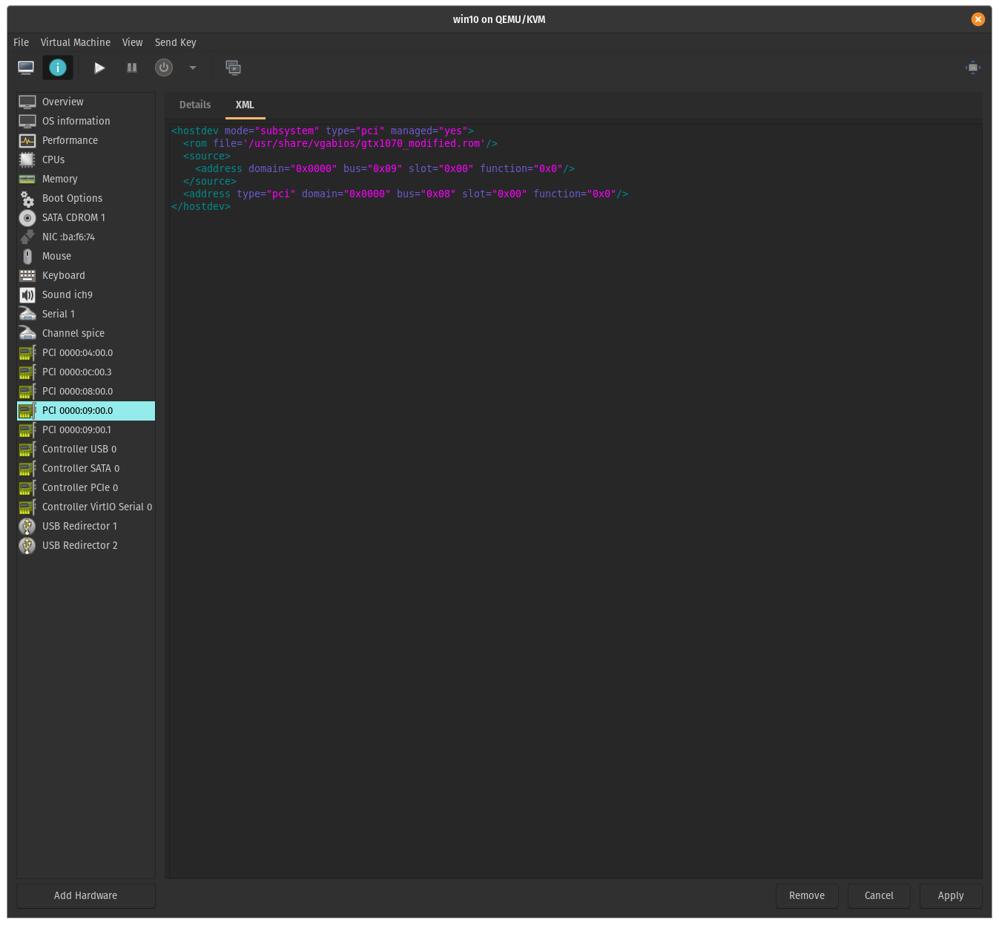

# Single GPU Passthrough (for Nvidia GPUs)

Passing through your main GPU from your Linux host into a Windows 10 VM

## Contents:

1. Introduction
2. Goals
3. Key Notes
4. Credits
5. Hardware and Software
6. Preparation
7. Hooks & Device Passthrough
8. VM WITHOUT GPU Passthrough
9. GPU Passthrough Settings & Setup
10. Starting VM with GPU Passthrough
11. Tips and Tricks

## Introduction

This tutorial walks you through the process of passing through your main GPU from your Linux host into a Windows 10 VM, and back to your Linux host automatically when you shut down the Windows VM. It will also have some tips and tricks on how to get it working as well as some important pointers to bear in mind.

## Goals

As is likely with most people, you will likely have only a single GPU in your system. If you need to passthrough the GPU to your Windows VM, say for gaming or running Windows specific programmes, this guide will walk you through the process.

## Key Notes

- I wrote this guide as a note for myself, but also to help anyone in a similar situation. It has been culled from different passthrough guides (see Credits).

- Please note that there are more comprehensive guides available (see Credits) for you to follow and learn about GPU passthrough, as well as doing it on different hardwares, OSs (even if the base distro is the same) and different boot environments (GRUB vs systemd for example).

- This method will shut down your display manager and make your host lose its session even if you have more than one GPU. I have tried every other passthrough guide available and only this one works for me specifically. All guides I have seen have lead me to believe that you can't unbind your GPU from the display manager without shutting down the display manager.

- Some may notice that I have a second graphics card in my system. It is used to power my second monitor. However, due to the age of the card, it is not possible to utilise this as the primary card for the Linux system. It should make no difference on being able to passthrough your main card.

- I am using the default display manager that comes with Pop OS (Gnome Display Manager).

- This may also work if you have an integrated GPU with an Nvidia dedicated GPU or an Optimus setup but your mileage may vary

## Credits

Credits always end up in the bottom of a guide, but I have to note that in this case, everything I am about to write here has been culled from other guides. The reason for writing this guide is that each of the guides have some end result which did not neatly match mine, and I'm adding my bit to improve the experience for others. That said, credits go to these sites / persons:

1. <b>Bryan Steiner and his excellent [GPU Passthrough Tutorial](https://github.com/bryansteiner/gpu-passthrough-tutorial)</b> <br />This gets the first mention as it was the guide that got me thinking that I could do this (oh boy!). It was elegently written and well documented. Unfortunately one factor I realised (too late) is that Bryan does not use his Nvidia GPU for video output, and only has it set to compute. This is a small but very key factor - if you use your card for video output, you will not be able to unbind the GPU if you use his method (at least I couldn't). This is however still the most thorough and succint guide and most of the non-GPU sections are actually culled from his guide.

2. <b>[Heiko Seiger](https://heiko-sieger.info/)'s guides at his blog</b><br />Heiko Seiger's guides just work. The guides are great as he walks you through passing through the GPU by removing it from the host OS and reserving it for the guest (VM). There are also pictures of bios settings etc. that will help you through the way. The only reason why this does not work for me is that all the resources are reserved and cannot be used by the host, which is not possible for me.

3. <b>Joe Knockenhauer's [Single GPU Passthrough](https://github.com/joeknock90)</b><br />I used his single GPU passthrough setup to guide to finally get this working. All the GPU passthrough scripts are basically from his guide.

4. <b>Others:</b>
   
   - [Mathias Hueber](https://mathiashueber.com/)'s blog
   - Arch Linux Wiki's [PCI Passthrough via OVMF Guide](https://wiki.archlinux.org/index.php/PCI_passthrough_via_OVMF)
   - SpaceInvader One's [How to easily passthough a Nvidia GPU as primary without dumping your own vbios!](https://www.youtube.com/watch?v=1IP-h9IKof0) video guide

## Hardware and Software

The following is my hardware setup:

```
  CPU :           Ryzen 3900X
  MB  :           Gigabyte Aorus Pro WiFi (using latest bios as of August 2020)
  RAM :           32GB
  Main Storage:   1TB P1 NVME SSD
  Host Storage:   500GB BX500 Sata SSD
  GPU:            NVidia GTX 1070 8GB
```

Monitor:

```
 G-Sync monitor attached to Nvidia card
```

Software:<br />

- Fresh install of Pop OS updated using `sudo apt update` and then `sudo apt upgrade`<br />
- Downloaded Windows 10 (version 2004) ISO

## Preparation

### Enable bios functionalities

The first and foremost step you have to follow is to check if virtualisation is enabled on your device. You have to, at a minimum, enable SVM and IOMMU in your bios settings. The other settings are good to have - if you don't see them, you may still be able to passthrough your hardware (though your mileage may vary). You will have to dig in through the menus of your board as the layout of the menu changes even through boards and generations (for example, my previous Gigabyte B450 board had a very different layout to the current one).

Also note that some bios versions may enable or disable certain functionalities in the latest bios, such as AER and ARI settings. This happened in the b450 board, and so you may want to roll back one generation if the latest bios is not needed for you (for example if the newer bios is just there for adding compatibility of newer CPUs).

I enabled the following settings in my bios. Please ensure that the settings are set to **Enabled** and ***not*** Auto:

```
Tweak
└── Advanced CPU Settings
    └── SVM Mode
        └── Enabled
Settings
└── AMD CBS
    └── NBIO Common Options
        └── IOMMU -> Enabled
        └── ACS Enable -> Enabled
        └── PCIe ARI Support -> Enabled
        └── PCIe ARi Enumeration -> Enabled
        └── Enable AER Cap -> Enabled
```

Save and exit bios.<br />

Please note that some of the AMD CBS settings may not be actually required for the passthrough, but I enabled them anyway and have had no issues. Again do not worry if you don't have all the options. You can go ahead and try anyway.

### Check & Prep your OS

Check for IOMMU support: `dmesg | grep IOMMU`

You should get an output similar to this:

```
[    0.818189] pci 0000:00:00.2: AMD-Vi: IOMMU performance counters supported
[    0.822627] pci 0000:00:00.2: AMD-Vi: Found IOMMU cap 0x40
[    0.823711] perf/amd_iommu: Detected AMD IOMMU #0 (2 banks, 4 counters/bank).
[    3.861007] AMD-Vi: AMD IOMMUv2 driver by Joerg Roedel <jroedel@suse.de>
```

Check for CPU virtualisation support: `dmesg | grep AMD-Vi`

You should get an output similar to this:

```
[    0.818189] pci 0000:00:00.2: AMD-Vi: IOMMU performance counters supported
[    0.822627] pci 0000:00:00.2: AMD-Vi: Found IOMMU cap 0x40
[    0.822628] pci 0000:00:00.2: AMD-Vi: Extended features (0x58f77ef22294ade):
[    0.822629] AMD-Vi: Interrupt remapping enabled
[    0.822630] AMD-Vi: Virtual APIC enabled
[    0.822630] AMD-Vi: X2APIC enabled
[    0.822707] AMD-Vi: Lazy IO/TLB flushing enabled
[    3.861007] AMD-Vi: AMD IOMMUv2 driver by Joerg Roedel <jroedel@suse.de>
```

You're now ready to get started

Pass the hardware-enabled IOMMU functionality into the kernel as a kernel parameter (note that kernelstub is already built in to Pop OS):

`sudo kernelstub --add-options "amd_iommu=on"`

Install all required packages: <br />`sudo apt install libvirt-daemon-system libvirt-clients qemu-kvm qemu-utils virt-manager ovmf`

I'd suggest at this point to `reboot`

Check for IOMMU groupings:

```
#!/bin/bash
shopt -s nullglob
for g in /sys/kernel/iommu_groups/*; do
    echo "IOMMU Group ${g##*/}:"
    for d in $g/devices/*; do
        echo -e "\t$(lspci -nns ${d##*/})"
    done;
done;
```

This is my output. Any hardware you want to passthrough to your VM must be in its own group. You must passthrough all hardware in your group, except for dummy, non hardware entries such as PCI bridge.

```
IOMMU Group 0:
    00:01.0 Host bridge [0600]: Advanced Micro Devices, Inc. [AMD] Starship/Matisse PCIe Dummy Host Bridge [1022:1482]
IOMMU Group 1:
    00:01.1 PCI bridge [0604]: Advanced Micro Devices, Inc. [AMD] Starship/Matisse GPP Bridge [1022:1483]
IOMMU Group 10:
    00:07.1 PCI bridge [0604]: Advanced Micro Devices, Inc. [AMD] Starship/Matisse Internal PCIe GPP Bridge 0 to bus[E:B] [1022:1484]
IOMMU Group 11:
    00:08.0 Host bridge [0600]: Advanced Micro Devices, Inc. [AMD] Starship/Matisse PCIe Dummy Host Bridge [1022:1482]
IOMMU Group 12:
    00:08.1 PCI bridge [0604]: Advanced Micro Devices, Inc. [AMD] Starship/Matisse Internal PCIe GPP Bridge 0 to bus[E:B] [1022:1484]
IOMMU Group 13:
    00:14.0 SMBus [0c05]: Advanced Micro Devices, Inc. [AMD] FCH SMBus Controller [1022:790b] (rev 61)
    00:14.3 ISA bridge [0601]: Advanced Micro Devices, Inc. [AMD] FCH LPC Bridge [1022:790e] (rev 51)
IOMMU Group 14:
    00:18.0 Host bridge [0600]: Advanced Micro Devices, Inc. [AMD] Matisse Device 24: Function 0 [1022:1440]
    00:18.1 Host bridge [0600]: Advanced Micro Devices, Inc. [AMD] Matisse Device 24: Function 1 [1022:1441]
    00:18.2 Host bridge [0600]: Advanced Micro Devices, Inc. [AMD] Matisse Device 24: Function 2 [1022:1442]
    00:18.3 Host bridge [0600]: Advanced Micro Devices, Inc. [AMD] Matisse Device 24: Function 3 [1022:1443]
    00:18.4 Host bridge [0600]: Advanced Micro Devices, Inc. [AMD] Matisse Device 24: Function 4 [1022:1444]
    00:18.5 Host bridge [0600]: Advanced Micro Devices, Inc. [AMD] Matisse Device 24: Function 5 [1022:1445]
    00:18.6 Host bridge [0600]: Advanced Micro Devices, Inc. [AMD] Matisse Device 24: Function 6 [1022:1446]
    00:18.7 Host bridge [0600]: Advanced Micro Devices, Inc. [AMD] Matisse Device 24: Function 7 [1022:1447]
IOMMU Group 15:
    01:00.0 Non-Volatile memory controller [0108]: Micron/Crucial Technology P1 NVMe PCIe SSD [c0a9:2263] (rev 03)
IOMMU Group 16:
    02:00.0 PCI bridge [0604]: Advanced Micro Devices, Inc. [AMD] Matisse Switch Upstream [1022:57ad]
IOMMU Group 17:
    03:03.0 PCI bridge [0604]: Advanced Micro Devices, Inc. [AMD] Matisse PCIe GPP Bridge [1022:57a3]
IOMMU Group 18:
    03:04.0 PCI bridge [0604]: Advanced Micro Devices, Inc. [AMD] Matisse PCIe GPP Bridge [1022:57a3]
IOMMU Group 19:
    03:08.0 PCI bridge [0604]: Advanced Micro Devices, Inc. [AMD] Matisse PCIe GPP Bridge [1022:57a4]
    06:00.0 Non-Essential Instrumentation [1300]: Advanced Micro Devices, Inc. [AMD] Starship/Matisse Reserved SPP [1022:1485]
    06:00.1 USB controller [0c03]: Advanced Micro Devices, Inc. [AMD] Matisse USB 3.0 Host Controller [1022:149c]
    06:00.3 USB controller [0c03]: Advanced Micro Devices, Inc. [AMD] Matisse USB 3.0 Host Controller [1022:149c]
IOMMU Group 2:
    00:01.2 PCI bridge [0604]: Advanced Micro Devices, Inc. [AMD] Starship/Matisse GPP Bridge [1022:1483]
IOMMU Group 20:
    03:09.0 PCI bridge [0604]: Advanced Micro Devices, Inc. [AMD] Matisse PCIe GPP Bridge [1022:57a4]
    07:00.0 SATA controller [0106]: Advanced Micro Devices, Inc. [AMD] FCH SATA Controller [AHCI mode] [1022:7901] (rev 51)
IOMMU Group 21:
    03:0a.0 PCI bridge [0604]: Advanced Micro Devices, Inc. [AMD] Matisse PCIe GPP Bridge [1022:57a4]
    08:00.0 SATA controller [0106]: Advanced Micro Devices, Inc. [AMD] FCH SATA Controller [AHCI mode] [1022:7901] (rev 51)
IOMMU Group 22:
    04:00.0 Network controller [0280]: Intel Corporation Wi-Fi 6 AX200 [8086:2723] (rev 1a)
IOMMU Group 23:
    05:00.0 Ethernet controller [0200]: Intel Corporation I211 Gigabit Network Connection [8086:1539] (rev 03)
IOMMU Group 24:
    09:00.0 VGA compatible controller [0300]: NVIDIA Corporation GP104 [GeForce GTX 1070] [10de:1b81] (rev a1)
    09:00.1 Audio device [0403]: NVIDIA Corporation GP104 High Definition Audio Controller [10de:10f0] (rev a1)
IOMMU Group 25:
    0a:00.0 VGA compatible controller [0300]: Advanced Micro Devices, Inc. [AMD/ATI] Cape Verde PRO [Radeon HD 7750/8740 / R7 250E] [1002:683f]
    0a:00.1 Audio device [0403]: Advanced Micro Devices, Inc. [AMD/ATI] Oland/Hainan/Cape Verde/Pitcairn HDMI Audio [Radeon HD 7000 Series] [1002:aab0]
IOMMU Group 26:
    0b:00.0 Non-Essential Instrumentation [1300]: Advanced Micro Devices, Inc. [AMD] Starship/Matisse PCIe Dummy Function [1022:148a]
IOMMU Group 27:
    0c:00.0 Non-Essential Instrumentation [1300]: Advanced Micro Devices, Inc. [AMD] Starship/Matisse Reserved SPP [1022:1485]
IOMMU Group 28:
    0c:00.1 Encryption controller [1080]: Advanced Micro Devices, Inc. [AMD] Starship/Matisse Cryptographic Coprocessor PSPCPP [1022:1486]
IOMMU Group 29:
    0c:00.3 USB controller [0c03]: Advanced Micro Devices, Inc. [AMD] Matisse USB 3.0 Host Controller [1022:149c]
IOMMU Group 3:
    00:02.0 Host bridge [0600]: Advanced Micro Devices, Inc. [AMD] Starship/Matisse PCIe Dummy Host Bridge [1022:1482]
IOMMU Group 30:
    0c:00.4 Audio device [0403]: Advanced Micro Devices, Inc. [AMD] Starship/Matisse HD Audio Controller [1022:1487]
IOMMU Group 4:
    00:03.0 Host bridge [0600]: Advanced Micro Devices, Inc. [AMD] Starship/Matisse PCIe Dummy Host Bridge [1022:1482]
IOMMU Group 5:
    00:03.1 PCI bridge [0604]: Advanced Micro Devices, Inc. [AMD] Starship/Matisse GPP Bridge [1022:1483]
IOMMU Group 6:
    00:03.2 PCI bridge [0604]: Advanced Micro Devices, Inc. [AMD] Starship/Matisse GPP Bridge [1022:1483]
IOMMU Group 7:
    00:04.0 Host bridge [0600]: Advanced Micro Devices, Inc. [AMD] Starship/Matisse PCIe Dummy Host Bridge [1022:1482]
IOMMU Group 8:
    00:05.0 Host bridge [0600]: Advanced Micro Devices, Inc. [AMD] Starship/Matisse PCIe Dummy Host Bridge [1022:1482]
IOMMU Group 9:
    00:07.0 Host bridge [0600]: Advanced Micro Devices, Inc. [AMD] Starship/Matisse PCIe Dummy Host Bridge [1022:1482]
```

Note that these are the things I want to passthrough:

- One set of USB ports (Group 29)
- The whole WiFi network / Bluetooth controller (Group 22)
- GPU (Group 24)
- Sata Controller (Group 20 or 21)

If your groups are not neatly divided, you can utilise the ACS patch - I would suggest reviewing Steiner's guide (see Credits) on this. Other than the GPU, passing through all the other items are optional for GPU passthrough.

### NOTE:

At this point the guide steps differ from the other guides in one fundamental way. Given the various issues you may face in passing through your GPU, I suggest following Joe Knockenhauer's point of creating a working VM first ***before*** attempting any kind of GPU passthrough. I have already tried passing through my other devices several times, and so I will start with that.

### ! Important.

From this point on, there will be fundamental changes, and issues you will have to be mindful of as you move along. For example, you can choose not to pass through neither USB devices (keyboard and mouse) nor a USB Controller, BUT that will mean that when you passthrough your GPU, you will have no way of controlling your VM. This is a catch-22 for most systems if you cannot passthrough your USB for one reason or another. 

***Note that you can actually passthrough specific USB devices and do not necessarily need to pass through a whole controller.***

## Hooks & Device Passthrough

We will begin prepping for the passthrough by creating the hooks.

Install the Hook Helper tool:

```
sudo wget 'https://raw.githubusercontent.com/PassthroughPOST/VFIO-Tools/master/libvirt_hooks/qemu' \
     -O /etc/libvirt/hooks/qemu
```

Convert to executable `sudo chmod +x /etc/libvirt/hooks/qemu` then restart **Libvirt** `sudo service libvirtd restart`.

Change over to the Libvirt hooks folder: `cd /etc/libvirt/hooks`. Running `ls -a` shows that there is only one folder `qemu` in the folder. Create the following folders:

```
sudo mkdir qemu.d qemu.d/win10 qemu.d/win10/prepare qemu.d/win10/prepare/begin qemu.d/win10/release qemu.d/win10/release/end
```

Check that your folder and file tree (`sudo apt install tree`) are as follows:

```
tree /etc/libvirt/hooks/
```

The output should be as follows:

```
/etc/libvirt/hooks
├── qemu
└── qemu.d
    └── win10
        ├── prepare
        │   └── begin
        └── release
            └── end
```

Change over to the **begin** folder `cd qemu.d/win10/prepare/begin`

Start the Nano file editor in sudo via `sudo nano`

Paste in your script:

```
#!/bin/bash
## Helpful to read output when debugging
set -x

## Load vfio
modprobe vfio
modprobe vfio_iommu_type1
modprobe vfio_pci

## Unbind the devices you would like to utilise in your vm
## USB
virsh nodedev-detach pci_0000_0c_00_3

## WIFI & BT Card
virsh nodedev-detach pci_0000_04_00_0

## SATA Controller
virsh nodedev-detach pci_0000_08_00_0
```

Note that for each PCI device you're passing through, convert colons and dots to underscore like these: `07:00.0` -> `0000_07_00_00` or `06:00.3` -> `0000_06_00_03`.  ***You have to put in YOUR own device's pci id.***

For Group 21 (SATA Controller), we do ***not*** need to pass through the PCI bridge

```
IOMMU Group 21:
    03:0a.0 PCI bridge [0604]: Advanced Micro Devices, Inc. [AMD] Matisse PCIe GPP Bridge [1022:57a4]
    08:00.0 SATA controller [0106]: Advanced Micro Devices, Inc. [AMD] FCH SATA Controller [AHCI mode] [1022:7901] (rev 51)
```

Press **Ctrl + O** to save. Name the file any name ending with .sh. I named mine `unbind.sh`. Exit nano by pressing **Ctrl + X**

You need to make the file executable by typing the following `sudo chmod +x unbind.sh`.

Change the folder to the **end** folder:

```
cd /etc/libvirt/hooks/qemu.d/win10/release/end
```

Start Nano again using `sudo nano`

```
#!/bin/bash
set -x

## Re-Bind all devices
virsh nodedev-reattach pci_0000_0c_00_3
virsh nodedev-reattach pci_0000_04_00_0
virsh nodedev-reattach pci_0000_08_00_0

## Unload vfio
modprobe -r vfio_pci
modprobe -r vfio_iommu_type1
modprobe -r vfio
```

Save using **Ctrl + O**. As before name the file with something ending with .sh. I have named mine `rebind.sh`.
Exit Nano using **Ctrl + X**
Convert `end.sh` into executable using `sudo chmod +x rebind.sh`

Check that your folder and files are in the following order:
```tree /etc/libvirt/hooks```

```
/etc/libvirt/hooks
/etc/libvirt/hooks
├── qemu
└── qemu.d
    └── win10
        ├── prepare
        │   └── begin
        │       └── unbind.sh
        └── release
            └── end
                └── rebind.sh
```

That's it for the scripts (sans any GPU passthrough settings).

## VM WITHOUT GPU Passthrough

It's now time to create your Windows VM without the GPU passtrough.

Go to your <b>Virtual Machine Manager (Virtman)</b>:

<p align="center"></p>

First and foremost, if this is your first time creating a VM, go to **Edit**, then **Preferences** and select **Enable XML Settings** under the **General** tab.

<p align="center"></p>

Now click on **Create a new virtual machine**. Select **local install**.

<p align="center"></p>

Click **Browse** and select your Windows 10 ISO file. It is recommended that you do not rename your Windows 10 ISO file - this way **Virtman** recognises the ISO as being a Windows 10 OS and will select the operating system automatically. If it doesn't detect it, uncheck the **Automatically detect** check box and just start typing 'Windows' and it will show Windows 10 as an option.

<p align="center"></p>

Select the amount of RAM you would like to passthrough as well as the number of CPUs. In this case, the maximum number of CPU's is actually the number of threads. You may want to keep some for the host system, especially if you are doing a *host passthrough* of your CPU (see later in this section).

<p align="center"></p>

Select your storage option and the appropriate size. The image shows the default option (which you would use if you are not passing through an SSD / NVMe / HDD). I have unchecked mine as I am aiming to pass through the whole SATA Controller (with its attached SATA drive).

<p align="center"></p>

In this section, check that the **Name** of the VM is `win10` specifically. This is important as Qemu will look up the hooks according to the name of the VM (of which we created the `win10` folder and the hooks within this folder). Ensure that you select **Customise configuration before install** as you will need to make additional changes before starting the VM. Select **Finish**.

<p align="center"></p>

You will now be in the settings section. The first thing to do is change the **Firmware** from `BIOS` to `OVMF_CODE.fd`. Click **Apply**.

<p align="center"></p>

Go to the CPUs section and uncheck **Copy Host CPU configuration**. Under **Model**, type in `host-passthrough` and click **Apply**.

<p align="center"></p>

Go to **Boot Options** and select **Enable boot menu**, ensure that `SATA Disk 1` as well `SATA CDROM 1` is selected. Move the `Sata Disk 1` up to the first position. Click **Apply**.

<p align="center"></p>

For now, I have left all the remaining items except **Tablet** (to remove, right click and select **Remove Hardware**). You can leave it in.

Now to add the hardware we are adding. Click on **Add Hardware**.

<p align="center"></p>

Go to **PCI Host Device**, select the first item you are adding and click **Finish**. Repeat this for all the other hardware you are adding. You should now see in the left section all the items you have added.

<p align="center"></p>

Note, if you are not passing through a full USB Controller, you can pass through individual USB devices (see below). See the section on passing through USB devices on Steiner's guide for more information.

<p align="center"></p>

This is how it should look now:

<p align="center"></p>

We should theoretically be ready to start the VM now. 

Go ahead and select **Begin Installation**. At this point, if you have done everything right, you should see a pop up and a few seconds later a window that opens up with TianoCore in the Splash Screen. Press any key to enter into the Windows setup once you see the prompt and you can now proceed to install Windows in your VM.

<p align="center"></p>

<p align="center"></p>

<p align="center"></p>

## GPU Passthrough Settings & Setup

Ok, now that your VM successfully runs (make sure to test it a few times - it should not hang when you unbind or rebind), it's time to finally get to the main part of this tutorial - passing through the GPU.

### Getting ROM for your card and including it on boot

Before you start this section, you should have your device bios ready. I looked up my bios via the Techpowerup [GPU Database](https://www.techpowerup.com/gpu-specs/) (thanks to a guide by SpaceInvader One's [How to easily passthough a Nvidia GPU as primary without dumping your own vbios! in KVM unRAID - YouTube](https://www.youtube.com/watch?v=1IP-h9IKof0)) but there are several ways you can approach this. I would suggest visiting [Joe's guide on patching the GPU ROM for this](https://github.com/joeknock90/Single-GPU-Passthrough#patching-the-gpu-rom-for-the-vm) as it has most of the ways you can use. Once you have your ROM ready, the following sections will walk you through the rest of the process.

### Editing the hooks

We go back to the original `unbind.sh` and `rebind.sh` scripts to now add in our GPU scripts.

First, edit the `unbind.sh` file.

```
cd /etc/libvirt/hooks/qemu.d/win10/prepare/begin
```

```
sudo nano unbind.sh
```

Add the following lines to your file just below the `set -x`

```
# Stop display manager
systemctl stop display-manager.service
## Kill the Gnome Display Manager
killall gdm-x-session

# Unbind VTconsoles
echo 0 > /sys/class/vtconsole/vtcon0/bind
echo 0 > /sys/class/vtconsole/vtcon1/bind

# Unbind EFI-Framebuffer
echo efi-framebuffer.0 > /sys/bus/platform/drivers/efi-framebuffer/unbind

# Avoid a Race condition by waiting 2 seconds. This can be calibrated to be shorter or longer if required for your system
sleep 2

# Unload all Nvidia drivers
modprobe -r nvidia_drm
modprobe -r nvidia_modeset
modprobe -r nvidia_uvm
modprobe -r nvidia
```

and below  `## Unbind the devices you would like to utilise in your vm`

```
## GPU
virsh nodedev-detach pci_0000_09_00_0
virsh nodedev-detach pci_0000_09_00_1
```

Please note that you should change your display driver pci id accordingly, based on your IOMMU groupings. Mine is below, and you will notice that you have to pass through both the controller (`09:00.0`) and the audio device on the graphics card (`09:00.1`). Please ensure you pass through all your GPU devices that sit under this group.

```
IOMMU Group 24:
    09:00.0 VGA compatible controller [0300]: NVIDIA Corporation GP104 [GeForce GTX 1070] [10de:1b81] (rev a1)
    09:00.1 Audio device [0403]: NVIDIA Corporation GP104 High Definition Audio Controller [10de:10f0] (rev a1)
```

Your full `unbind.sh` file should now look like this (cleaned up):

```
#!/bin/bash
## Helpful to read output when debugging
set -x

# Stop display manager
systemctl stop display-manager.service
## Uncomment the following line if you use GDM
killall gdm-x-session

# Unbind VTconsoles
echo 0 > /sys/class/vtconsole/vtcon0/bind
echo 0 > /sys/class/vtconsole/vtcon1/bind

# Unbind EFI-Framebuffer
echo efi-framebuffer.0 > /sys/bus/platform/drivers/efi-framebuffer/unbind

# Avoid a Race condition by waiting 2 seconds. This can be calibrated to be shorter or longer if required for your system
sleep 2

# Unload all Nvidia drivers
modprobe -r nvidia_drm
modprobe -r nvidia_modeset
modprobe -r nvidia_uvm
modprobe -r nvidia

## Load vfio
modprobe vfio
modprobe vfio_iommu_type1
modprobe vfio_pci

## Unbind the devices you would like to utilise in your vm

## GPU
virsh nodedev-detach pci_0000_09_00_0
virsh nodedev-detach pci_0000_09_00_1

## USB
virsh nodedev-detach pci_0000_0c_00_3

## WIFI & BT Card
virsh nodedev-detach pci_0000_04_00_0

## SATA Controller
virsh nodedev-detach pci_0000_08_00_0
```

Press **Ctrl + O** and **Enter** to save and then **Ctrl + X** to exit.

Now time to edit the `rebind.sh` file.

```
cd /etc/libvirt/hooks/qemu.d/win10/release/end
```

```
sudo nano rebind.sh
```

Paste the following below the `## Re-Bind all devices` section,

```
virsh nodedev-reattach pci_0000_09_00_0
virsh nodedev-reattach pci_0000_09_00_1
```

and the following below the  `## Unload vfio` section.

```
# Rebind VT consoles
echo 1 > /sys/class/vtconsole/vtcon0/bind
echo 1 > /sys/class/vtconsole/vtcon1/bind

nvidia-xconfig --query-gpu-info > /dev/null 2>&1
echo "efi-framebuffer.0" > /sys/bus/platform/drivers/efi-framebuffer/bind

modprobe nvidia_drm
modprobe nvidia_modeset
modprobe nvidia_uvm
modprobe nvidia

# Restart Display Manager
systemctl start display-manager.service
```

Your cleaned up `rebind.sh` file should look like this:

```
#!/bin/bash
set -x

## Re-Bind all devices
virsh nodedev-reattach pci_0000_0c_00_3
virsh nodedev-reattach pci_0000_04_00_0
virsh nodedev-reattach pci_0000_08_00_0
virsh nodedev-reattach pci_0000_09_00_0
virsh nodedev-reattach pci_0000_09_00_1

## Unload vfio
modprobe -r vfio_pci
modprobe -r vfio_iommu_type1
modprobe -r vfio

# Rebind VT consoles
echo 1 > /sys/class/vtconsole/vtcon0/bind
echo 1 > /sys/class/vtconsole/vtcon1/bind

nvidia-xconfig --query-gpu-info > /dev/null 2>&1
echo "efi-framebuffer.0" > /sys/bus/platform/drivers/efi-framebuffer/bind

modprobe nvidia_drm
modprobe nvidia_modeset
modprobe nvidia_uvm
modprobe nvidia

# Restart Display Manager
systemctl start display-manager.service
```

Again save by pressing **Ctrl + O** and then **Enter** and then exit by pressing **Ctrl + X**.

### Including GPU into VM

#### Add device

Now you are ready to add your GPU to your VM. Open up **Virtman**. 

<p align="center"></p>

Click on your Windows 10 VM and then click ****Open**** on the menu above. 

<p align="center"></p>

You will see the blank window above. Click on the ***i*** button to show the settings.

<p align="center"></p>

Click on **Add Hardware** and add the 2 devices associated with your GPU. Please ensure that you add all the devices in your GPU (you may have more than 2).

#### Remove other displays

Remove **Display Spice** and **Video QXL** (right click on the device and select **Remove**).

#### Add ROM File

Create a new folder called `vgabios` in your `/usr/share/` folder via `sudo mkdir /usr/share/vgabios`

Copy your ROM file to the folder.

```
sudo cp -v -i '/home/yourusername/gtx1070_modified.rom' /usr/share/vgabios/gtx1070_modified.rom
```

(the above command is copying the modified ROM file in my `Home` folder to the `vgabios` folder. Change the line `/home/yourusername/gtx1070_modified.rom` to where ever your ROM is stored and also the name of the file).

The file does not need to have a specific name. Also, your file may be either a `.rom` or `.bin`, which should be fine.

Go back to your **Virtman**. Select your GPU device (the main one only - it usually is the one ending with 0). 

<p align="center"></p>

Add the following line (edit the name of your file):

```
<rom file='/usr/share/vgabios/gtx1070_modified.rom'/>
```

to the XML (see picture above)

```
<hostdev mode="subsystem" type="pci" managed="yes">
  <rom file='/usr/share/vgabios/gtx1070_modified.rom'/>
  ...
</hostdev>
```

Click **Apply**.

#### Edit XML Script

You're almost ready to launch the VM with your GPU passed through, but one last set of items to edit.

Navigate back to **Overview** in the settings of **Virtman**. Click on the **XML** tab.

Add the following lines:

```
  <features>
    ...
    <hyperv>
      ...
      <vendor_id state="on" value="kvm hyperv"/>
    </hyperv>
    ...
  </features>
```

and

```
  <features>
    ...
    <hyperv>
      ...
    </hyperv>
    <kvm>
      <hidden state="on"/>
    </kvm>
    ...
  </features>
```

and finally

```<features>
  <features>
    ...
    <ioapic driver="kvm"/>
  </features>
```

Your <features> section should now look like this:

```
  <features>
    <acpi/>
    <apic/>
    <hyperv>
      <relaxed state="on"/>
      <vapic state="on"/>
      <spinlocks state="on" retries="8191"/>
      <vendor_id state="on" value="kvm hyperv"/>
    </hyperv>
    <kvm>
      <hidden state="on"/>
    </kvm>
    <vmport state="off"/>
    <ioapic driver="kvm"/>
  </features>
```

Click **Apply** to apply the settings. 

### ! Note

Please note that before you move on to the next section (start your VM), you should save anything you have open in Linux as all applications will be closed once you shut down the display manager.

## Starting VM with GPU Passthrough

You are now ready to start your VM! Press the **Play** buttion on the menu.

If everything goes right, your screen will go blank, and you will see the TianoCore launch screen and boot into Windows.

To go back to Linux, just shut down your Windows, and Libvirt should automatically take you back to Linux (your log in screen).

## Tips and Tricks

1. Before proceeding to the GPU section, ensure that your USB passthrough works correctly. Whether you are passing through your USB devices or your whole USB controller, you should check that it works correctly. If you accidentally forget this part, and your USB does not work, you will just have to reset your PC to exit.

2. The fastest way to get your ROM is to get it from the Techpowerup site. Often, ROMs on this site already have the bios edited but your mileage may vary. Please note that you should look up your exact device and revision as there are differences between brands, AND revisions of the same model.

3. You can theoretically [leave applications in Linux running in the background while on your VM](https://github.com/joeknock90/Single-GPU-Passthrough#note), but this is not advisable.

4. You can store your ROM in a different folder than the one suggested, but this may sometimes be an issue. If you get an error along the lines of [failed to find / load romfile](https://github.com/joeknock90/Single-GPU-Passthrough#failed-to-findload-romfile) (in your log file, see pointer number 6), then this is likely to be the cause.

5. At this point, this guide does not include optimisations for your VM. The section on [improving VM performance](https://github.com/bryansteiner/gpu-passthrough-tutorial#----part-4-improving-vm-performance) in Steiner's guide is a good place to get some optimisation tips and tricks.

6. If you run into issues, you can check the log file at `nano /var/log/libvirt/qemu/win10.log` to see if it has helpful pointers. 

7. You can change the boot order after having installed Windows in your VM.

## Conclusion

I hope this guide works for you. If you notice any errors, please do let me know.
